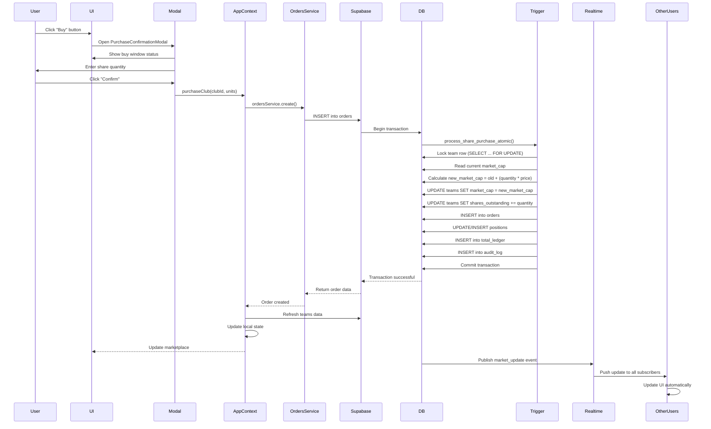
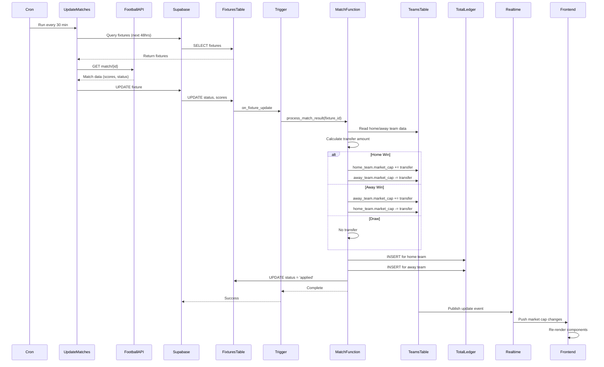
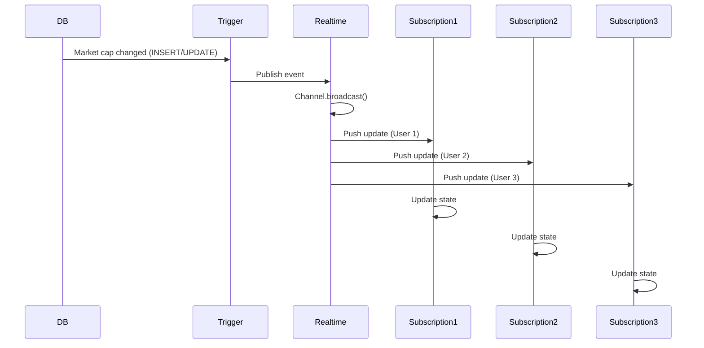
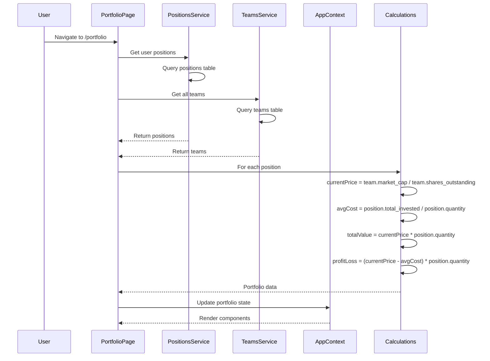
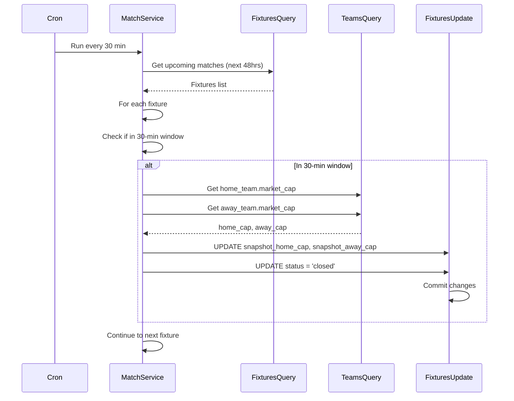
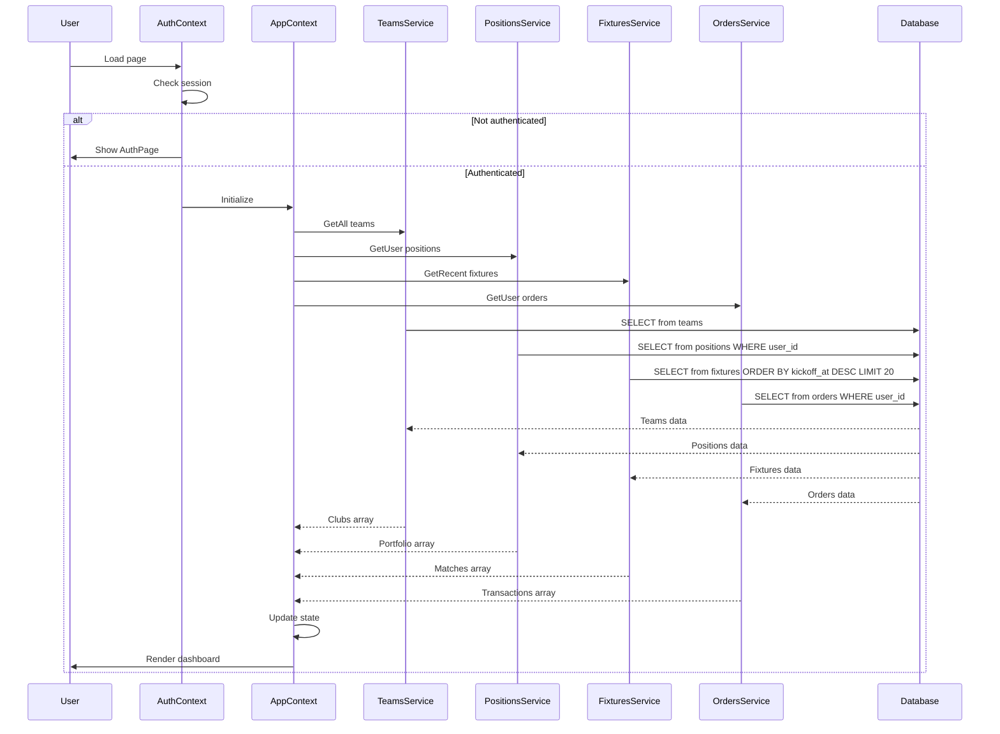
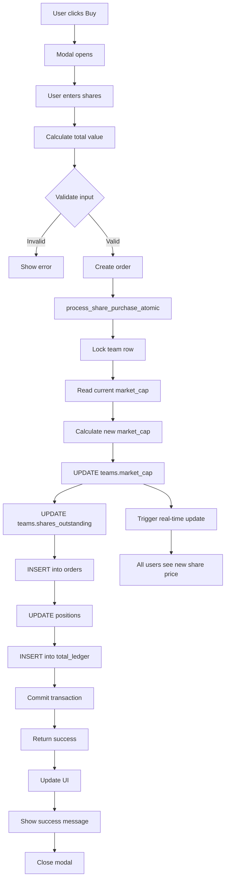
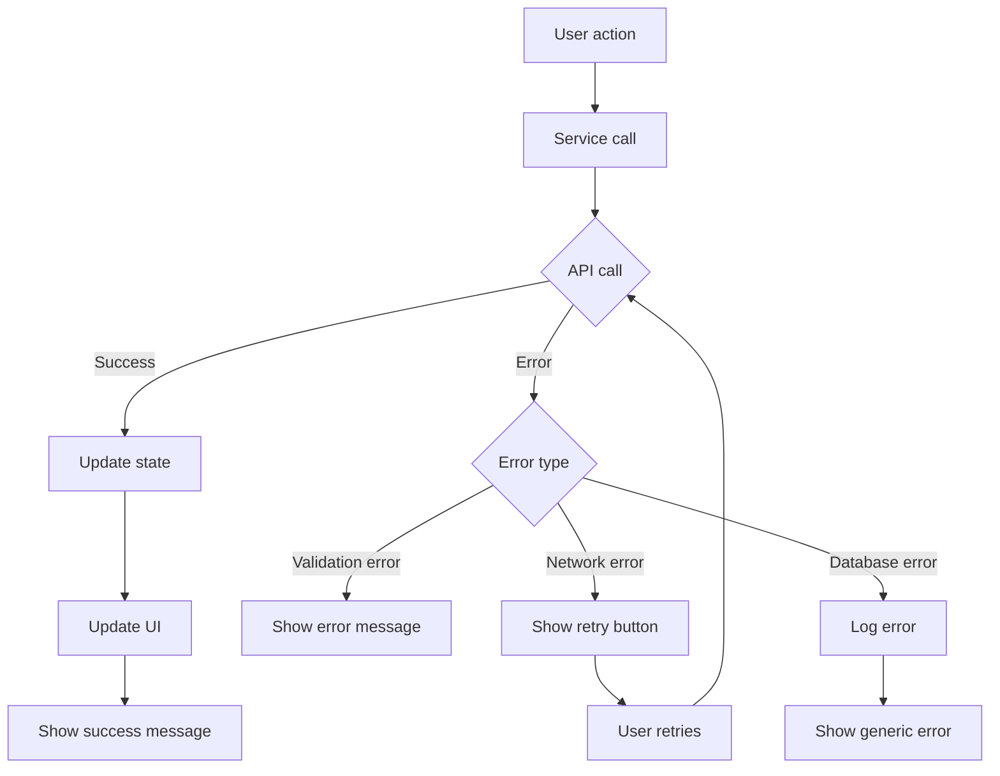

# Data Flow Diagrams - Football Trading Platform

## 1. Share Purchase Flow



**Key Points:**
- Atomic transaction ensures data consistency
- Market cap updated immediately
- Real-time update to all users
- Audit log records every transaction

---

## 2. Match Result Processing Flow



**Transfer Calculation:**
```sql
transfer_amount = loser.market_cap * 0.10

Winner.market_cap += transfer_amount
Loser.market_cap -= transfer_amount
```

---

## 3. Real-time Market Update Flow



**Subscribed Channels:**
- `market-updates` - Team market cap changes
- `new-orders` - New trades executed
- `position-updates` - User position changes
- `fixture-updates` - Match status changes

---

## 4. Portfolio Calculation Flow



**Calculation Logic:**
```typescript
interface PortfolioItem {
  clubId: string;
  clubName: string;
  units: number;
  purchasePrice: number; // average cost
  currentPrice: number;
  totalValue: number;
  profitLoss: number;
  percentChange: number;
}
```

---

## 5. Snapshot Capture Flow



**Purpose:**
- Capture market cap at 30 min before kickoff
- Prevent trading during match
- Use snapshots to calculate fair market cap transfers

---

## 6. Initial Data Load Flow



**Parallel Queries:**
All services fetch data concurrently using `Promise.all()` for faster initial load.

---

## 7. Market Cap Update from Order



---

## Key Data Relationships

### One-to-Many Relationships
```
teams (1) → fixtures (many)
teams (1) → orders (many)
teams (1) → positions (many)
users (1) → orders (many)
users (1) → positions (many)
fixtures (1) → total_ledger (many)
```

### Join Queries
```sql
-- Get fixture with team names
SELECT f.*, h.name as home_team, a.name as away_team
FROM fixtures f
JOIN teams h ON f.home_team_id = h.id
JOIN teams a ON f.away_team_id = a.id;

-- Get positions with team data
SELECT p.*, t.name as team_name, t.market_cap
FROM positions p
JOIN teams t ON p.team_id = t.id
WHERE p.user_id = $1;
```

---

## Error Handling Flow



---

## Performance Flow

1. **Code Splitting**: Heavy components loaded lazily
2. **Memoization**: Expensive calculations cached with useMemo
3. **Batch Updates**: Multiple state updates batched
4. **Debouncing**: Rapid inputs debounced
5. **Pagination**: Large lists paginated
6. **Virtual Scrolling**: Long lists rendered efficiently
