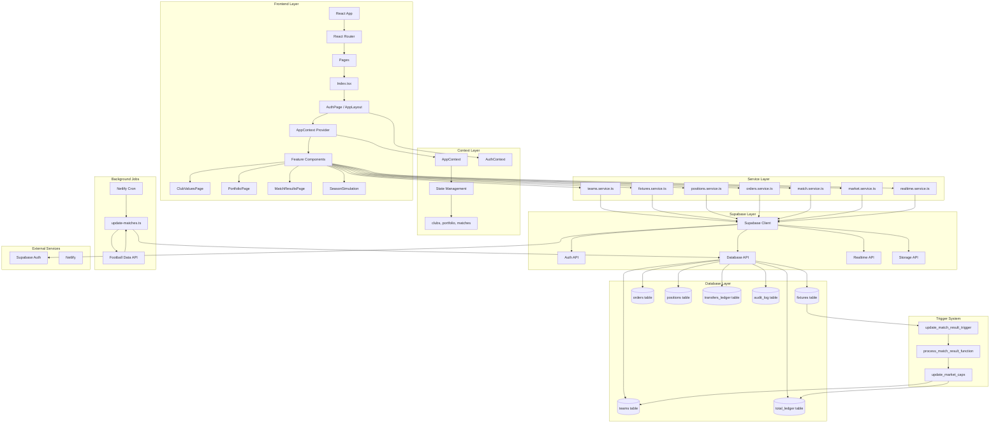
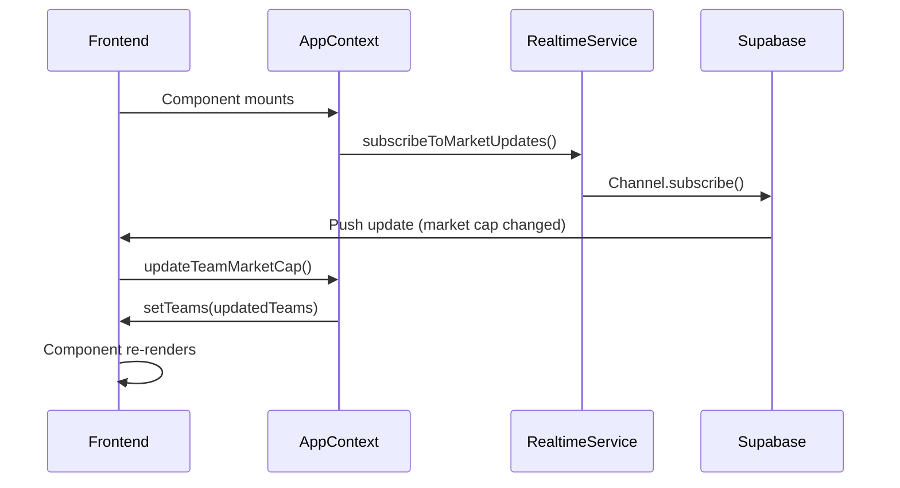

# Technical Architecture - Football Trading Platform

## System Architecture Diagram



---

## Component Hierarchy

```
App
├── ErrorBoundary
├── QueryClientProvider
├── ThemeProvider
└── TooltipProvider
    └── AuthProvider
        └── BrowserRouter
            └── Routes
                └── Index.tsx
                    ├── AuthPage (if not authenticated)
                    └── AppProvider
                        └── AppLayout
                            ├── Sidebar
                            ├── Header
                            └── Routes
                                ├── /marketplace → ClubValuesPage
                                ├── /portfolio → PortfolioPage
                                ├── /matches → MatchResultsPage
                                ├── /simulation → SeasonSimulation
                                └── /standings → StandingsPage
```

---

## Database Schema

### Core Tables

#### teams
```sql
- id (primary key)
- name
- short_name
- external_id (FK to Football Data API)
- logo_url
- launch_price
- initial_market_cap
- market_cap (current)
- shares_outstanding
- total_shares
- is_latest
- created_at
- updated_at
```

#### fixtures
```sql
- id (primary key)
- external_id
- home_team_id (FK → teams.id)
- away_team_id (FK → teams.id)
- kickoff_at
- status (scheduled/closed/live/completed/applied)
- result (home_win/away_win/draw/pending)
- home_score
- away_score
- snapshot_home_cap
- snapshot_away_cap
- created_at
- updated_at
```

#### orders
```sql
- id (primary key)
- user_id (FK → auth.users)
- team_id (FK → teams.id)
- order_type (buy/sell)
- quantity
- price_per_share
- total_value
- market_cap_before
- market_cap_after
- shares_outstanding_before
- shares_outstanding_after
- status (pending/completed/failed)
- created_at
- updated_at
```

#### positions
```sql
- id (primary key)
- user_id (FK → auth.users)
- team_id (FK → teams.id)
- quantity
- average_cost
- total_invested
- created_at
- updated_at
```

#### total_ledger
```sql
- id (primary key)
- user_id (FK → auth.users)
- team_id (FK → teams.id)
- ledger_type (purchase/match/initial_state)
- quantity (for purchases)
- share_price_before
- share_price_after
- market_cap_before
- market_cap_after
- event_date
- event_description
- created_at
```

---

## Service Layer Architecture

### teams.service.ts
**Responsibilities:**
- Fetch all teams
- Get team by ID
- Update market cap
- Capture market cap snapshots
- Get market cap history

### fixtures.service.ts
**Responsibilities:**
- Fetch fixtures
- Get fixtures by status
- Get fixtures needing snapshots
- Get fixtures needing processing
- Update fixture status

### positions.service.ts
**Responsibilities:**
- Get user positions
- Update positions
- Calculate portfolio value
- Get portfolio statistics

### orders.service.ts
**Responsibilities:**
- Create orders
- Get user orders
- Get orders by team
- Get order history

### match.service.ts (New - Unified)
**Responsibilities:**
- Monitor upcoming matches
- Update fixtures from Football API
- Capture market cap snapshots
- Process match results
- Track match statistics

### market.service.ts (New)
**Responsibilities:**
- Calculate share prices (NAV)
- Calculate profit/loss
- Calculate percent changes
- Validate purchases
- Format market data

### realtime.service.ts
**Responsibilities:**
- Subscribe to market updates
- Subscribe to new orders
- Subscribe to position changes
- Subscribe to fixture updates

---

## Trigger System

### Database Triggers

1. **on_fixture_insert**
   - Fired when new fixture inserted
   - Captures initial market caps
   - Sets snapshot data

2. **on_fixture_update**
   - Fired when fixture updated
   - Checks if match status changed
   - Triggers market cap transfer if match completed

3. **on_order_insert**
   - Fired when new order created
   - Triggers `process_share_purchase_atomic()`
   - Updates market cap and positions

### Functions

#### process_share_purchase_atomic()
```sql
1. Lock team row
2. Read current market cap and shares
3. Calculate new market cap = old + (quantity * price)
4. Update teams.market_cap
5. Insert into orders table
6. Update/insert into positions
7. Insert into total_ledger
8. Commit transaction
```

#### process_match_result(fixture_id)
```sql
1. Get fixture data
2. Calculate transfer amount
   - Transfer = 10% of loser's market cap
3. Update winner's market cap (+transfer)
4. Update loser's market cap (-transfer)
5. Insert into transfers_ledger
6. Insert into total_ledger for both teams
7. Mark fixture as 'applied'
```

---

## Real-time Subscription Flow



**Active Subscriptions:**
- `teams` table (market cap updates)
- `orders` table (new trades)
- `positions` table (portfolio updates)
- `fixtures` table (match updates)

---

## Background Job Architecture

### Netlify Cron Job: update-matches.ts

**Schedule:** Every 30 minutes

**Process:**
1. Query fixtures needing updates (next 48 hours)
2. For each fixture:
   - If kickoff is within 30 min → capture snapshots
   - If match is live → fetch scores from API
   - If match finished → trigger market cap updates
3. Update fixture records
4. Database triggers handle market cap calculations

### Football Data API Integration

**Endpoints Used:**
- `GET /competitions/PL/matches` - Get all fixtures
- `GET /matches/{id}` - Get specific match
- `GET /teams` - Get team information

**Authentication:**
- API key via environment variable
- Rate limiting: 10 requests/minute

---

## State Management Pattern

### AppContext Structure

```typescript
interface AppContextType {
  // State
  clubs: Club[]
  portfolio: PortfolioItem[]
  matches: Match[]
  transactions: Transaction[]
  
  // Actions
  purchaseClub: (clubId: string, units: number) => Promise<void>
  simulateMatch: () => void
  refreshData: () => Promise<void>
  
  // UI State
  loading: boolean
  sidebarOpen: boolean
}
```

**Data Flow:**
1. AppContext fetches data on mount
2. Components consume context via `useAppContext()`
3. Actions update database via services
4. Real-time subscriptions update context
5. Components re-render automatically

---

## Authentication & Authorization

### Auth Flow
1. User signs up/logs in via Supabase Auth
2. JWT token stored in localStorage
3. AuthContext manages user session
4. Protected routes check authentication
5. RLS policies enforce data access

### Authorization Levels

**Regular User:**
- Can purchase shares
- Can view own portfolio
- Can view team details
- Cannot modify database directly

**Admin:**
- All user capabilities
- Can access admin dashboard
- Can manually update market caps
- Can trigger match processing

### RLS Policies

```sql
-- Positions: Users can only see their own
CREATE POLICY "Users can view own positions"
ON positions FOR SELECT
USING (auth.uid() = user_id);

-- Orders: Users can only see their own
CREATE POLICY "Users can view own orders"
ON orders FOR SELECT
USING (auth.uid() = user_id);

-- Teams: Everyone can read
CREATE POLICY "Teams are viewable by everyone"
ON teams FOR SELECT
USING (true);
```

---

## Performance Optimizations

### Code Splitting
- Heavy components lazy-loaded
- Route-based splitting
- Dynamic imports for chart libraries

### Database Query Optimization
- Use joins instead of N+1 queries
- Batch operations where possible
- Index frequently queried columns
- Cache team details in localStorage

### Real-time Optimization
- Subscribe only to necessary tables
- Debounce rapid updates
- Use React Query for caching

---

## Error Handling

### Client-Side
- Error boundaries on all pages
- Toast notifications for errors
- Fallback UI for failed states
- Retry logic for API calls

### Server-Side
- Database constraints prevent invalid data
- Atomic transactions ensure consistency
- Rollback on errors
- Comprehensive logging

---

## Security Measures

### Input Validation
- All user inputs sanitized
- Type checking via TypeScript
- Zod schemas for runtime validation

### SQL Injection Prevention
- Supabase client handles parameterization
- No raw SQL queries from frontend
- All queries use type-safe methods

### XSS Prevention
- React automatically escapes content
- Sanitize any HTML rendering
- Content Security Policy headers

### CSRF Protection
- SameSite cookies
- CSRF tokens in forms
- CORS configured properly
