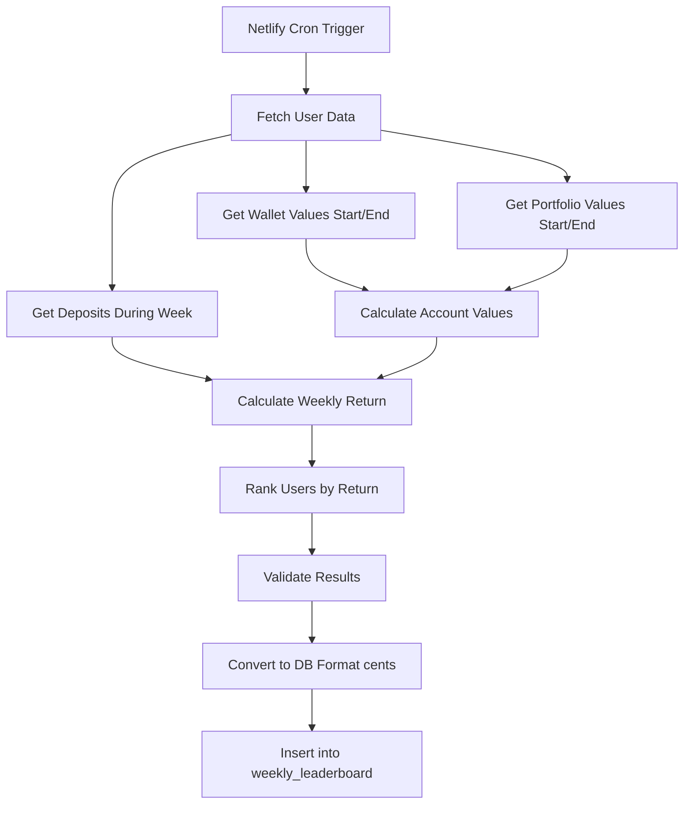

# Weekly Leaderboard Calculation Synchronization

## Overview

This document explains the centralized calculation system for the weekly leaderboard to ensure **perfect consistency** between frontend display and backend calculation.

## The Problem

Previously, the weekly leaderboard had **two separate calculation implementations**:

1. **Backend (Netlify Function)**: SQL-based calculations in `generate_weekly_leaderboard_exact_v2` RPC function
2. **Frontend (React App)**: TypeScript calculations using `Decimal.js` library

This caused **discrepancies** because:
- SQL numeric operations have different rounding behavior than JavaScript
- Decimal.js provides higher precision than PostgreSQL's `numeric` type by default
- Different calculation order can compound rounding errors

## The Solution

We've created a **single source of truth** for all leaderboard calculations using TypeScript and `Decimal.js`:

### 1. Centralized Calculation Module

**File**: `src/shared/lib/utils/leaderboard-calculations.ts`

This module provides:
- `calculateWeeklyReturn()` - Weekly ROI calculation
- `calculateAccountValue()` - Wallet + Portfolio total
- `calculateLeaderboard()` - Full leaderboard ranking
- `toLeaderboardDbFormat()` - Convert to database format (cents)
- `fromLeaderboardDbFormat()` - Convert from database format
- `validateLeaderboardEntries()` - Validation checks

### 2. Updated Netlify Function

**File**: `netlify/functions/update-weeklyleaderboard.ts`

Changes:
- ✅ Imports centralized calculation utilities
- ✅ Fetches raw data from database (wallet, portfolio, deposits)
- ✅ Uses TypeScript + Decimal.js for all calculations
- ✅ No longer relies on SQL RPC function
- ✅ Same calculation logic as frontend

### 3. Updated Backfill Script

**File**: `scripts/calculate-weekly-leaderboard.ts`

Changes:
- ✅ Imports centralized calculation utilities
- ✅ Uses same data fetching and calculation logic
- ✅ Perfect consistency with Netlify function and frontend

## Weekly Return Formula

The weekly return (ROI) accounts for deposits during the week:

```
Weekly Return = (End Account - Start Account - Deposits) / (Start Account + Deposits)
```

### Edge Cases:
- If `(Start Account + Deposits) <= 0`, return `0`
- Returns a **decimal fraction** (e.g., 0.0523 for 5.23%)
- Rounded to **6 decimal places** to match DB schema: `numeric(10, 6)`

### Examples:

**Example 1: No deposits**
- Start: $100
- End: $110
- Deposits: $0
- Return: (110 - 100 - 0) / (100 + 0) = **0.10 (10%)**

**Example 2: With deposits**
- Start: $100
- End: $160
- Deposits: $50
- Return: (160 - 100 - 50) / (100 + 50) = **0.066667 (6.67%)**
  - Without accounting for deposits, it would incorrectly show 60% return!

**Example 3: Loss with deposits**
- Start: $100
- End: $140
- Deposits: $50
- Return: (140 - 100 - 50) / (100 + 50) = **-0.066667 (-6.67%)**

## Data Flow

### Weekly Leaderboard Generation (Monday 03:00 UAE)



### Data Sources

1. **Wallet Values**
   - Table: `wallet_transactions`
   - Field: `balance_after` (bigint cents)
   - Logic: Last transaction before week_start/week_end

2. **Portfolio Values**
   - Tables: `positions` + `total_ledger`
   - Logic: Sum of (team_price × user_quantity) for each position
   - Team prices from `total_ledger.share_price_after` at week boundaries

3. **Deposits**
   - Table: `wallet_transactions`
   - Filter: `type = 'deposit'` AND `created_at` BETWEEN week_start AND week_end
   - Sum: `amount_cents` converted to dollars

## Database Schema

### `weekly_leaderboard` Table

```sql
create table public.weekly_leaderboard (
  id bigint generated by default as identity not null,
  user_id uuid not null,
  week_start timestamp with time zone not null,
  week_end timestamp with time zone not null,
  
  -- All monetary values stored as BIGINT (cents)
  start_wallet_value bigint not null,
  start_portfolio_value bigint not null,
  start_account_value bigint not null,
  end_wallet_value bigint not null,
  end_portfolio_value bigint not null,
  end_account_value bigint not null,
  deposits_week bigint not null default 0,
  
  -- Weekly return as decimal fraction (NOT percentage)
  weekly_return numeric(10, 6) not null,
  
  rank integer not null,
  is_latest boolean not null default false,
  created_at timestamp with time zone not null default now(),
  week_number integer null,
  
  constraint weekly_leaderboard_pkey primary key (id),
  constraint weekly_leaderboard_user_id_fkey foreign key (user_id) 
    references profiles (id) on delete cascade
);
```

### Storage Format

- **Monetary values**: Stored as `bigint` (cents), displayed as dollars
  - Example: $147.26 stored as 14726
  - Conversion: `cents = dollars * 100` (rounded to nearest cent)
  
- **Weekly return**: Stored as `numeric(10, 6)` (decimal fraction)
  - Example: 5.23% stored as 0.052300
  - Display: Multiply by 100 for percentage

## Frontend Display

### Converting from Database

```typescript
import { fromLeaderboardDbFormat } from '@/shared/lib/utils/leaderboard-calculations';

// Database row (cents)
const dbEntry = {
  user_id: '...',
  start_account_value: 14726, // cents
  end_account_value: 15936,   // cents
  weekly_return: 0.052300,    // decimal fraction
  rank: 1
};

// Convert to display format (dollars)
const displayEntry = fromLeaderboardDbFormat(dbEntry);
// {
//   start_account_value: 147.26,  // dollars
//   end_account_value: 159.36,    // dollars
//   weekly_return: 0.052300,      // decimal fraction (multiply by 100 for %)
//   rank: 1
// }

// Display as percentage
const percentageReturn = displayEntry.weekly_return * 100; // 5.23%
```

## Testing

### Manual Testing

1. **Test Netlify Function Manually**:
```bash
curl -X POST https://your-site.netlify.app/.netlify/functions/update-weeklyleaderboard \
  -H "x-manual-run: true"
```

2. **Test Backfill Script**:
```bash
npx tsx scripts/calculate-weekly-leaderboard.ts --weeks 1
```

### Validation Checks

The `validateLeaderboardEntries()` function checks for:
- ✅ No NaN or Infinity values
- ✅ No negative end account values
- ✅ Reasonable return values (-100% to +1000%)
- ✅ All required fields present

### Comparing Results

To verify consistency, check that:
1. Backend calculated values match frontend calculations
2. Week-over-week changes make sense
3. Rankings are consistent with return percentages

## Migration Notes

### Deprecation

The following SQL functions are **no longer used**:
- ❌ `generate_weekly_leaderboard_exact_v2` - Replaced by TypeScript calculations
- ❌ `new_generate_weekly_leaderboard` - Old implementation

These can be kept in the database for backward compatibility or removed.

### Benefits

✅ **Single Source of Truth**: All calculations use same TypeScript code  
✅ **Precision**: Decimal.js ensures consistent rounding  
✅ **Testability**: Can test calculations in isolation  
✅ **Maintainability**: One place to update calculation logic  
✅ **Transparency**: Calculations are easier to audit in TypeScript than SQL  
✅ **Consistency**: Frontend and backend guaranteed to match  

## Common Issues

### Issue: Leaderboard values don't match portfolio page

**Cause**: Data fetched at different times  
**Solution**: Leaderboard uses historical snapshots at week boundaries, portfolio shows current values

### Issue: Negative returns after deposits

**Cause**: Not accounting for deposits in return calculation  
**Solution**: Formula already accounts for this: `(end - start - deposits) / (start + deposits)`

### Issue: Returns seem too high/low

**Cause**: Incorrect data or calculation error  
**Solution**: Check validation errors, verify source data is correct

## Future Improvements

1. **Caching**: Cache intermediate calculations to reduce database queries
2. **Incremental Updates**: Only recalculate changed positions
3. **Real-time Leaderboard**: Update rankings throughout the week (separate from weekly snapshot)
4. **Performance Metrics**: Track calculation time and optimize slow queries

## Related Files

- `src/shared/lib/utils/leaderboard-calculations.ts` - Core calculations
- `src/shared/lib/utils/decimal.ts` - Decimal precision utilities  
- `src/shared/lib/utils/calculations.ts` - General financial calculations
- `netlify/functions/update-weeklyleaderboard.ts` - Weekly cron job
- `scripts/calculate-weekly-leaderboard.ts` - Manual backfill script
- `src/features/leaderboard/components/LeaderboardPage.tsx` - Frontend display

## Support

For questions or issues:
1. Check validation error messages in logs
2. Verify database data is correct
3. Test calculations with known values
4. Compare TypeScript vs SQL results

---

**Last Updated**: February 2026  
**Version**: 2.0 (Centralized TypeScript calculations)
